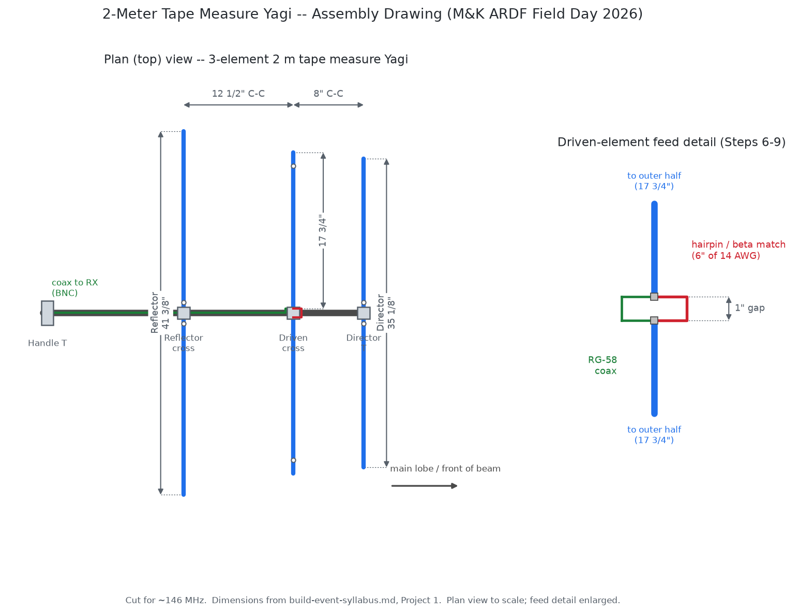
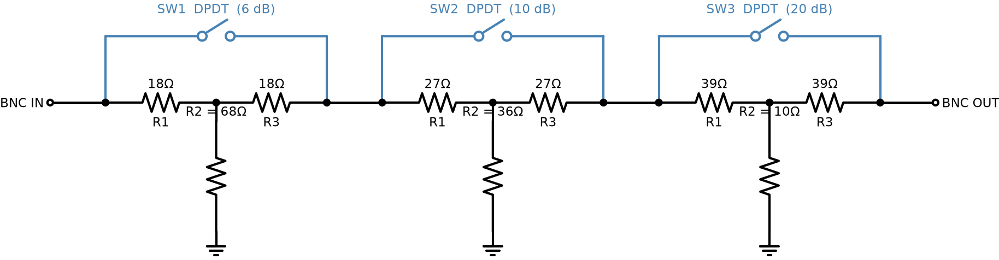
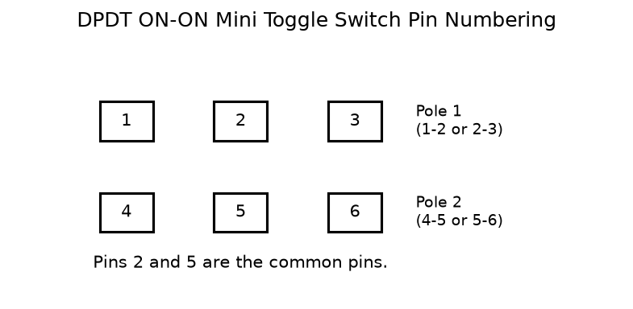
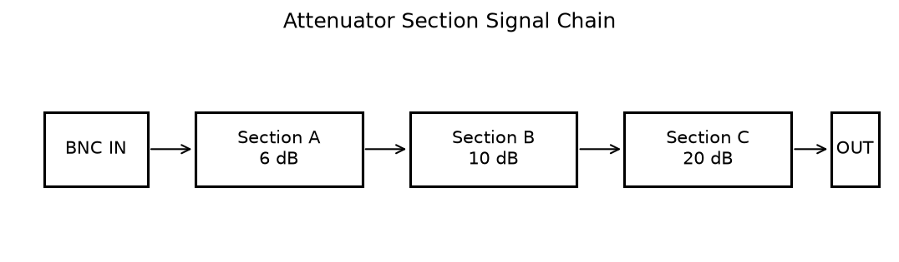
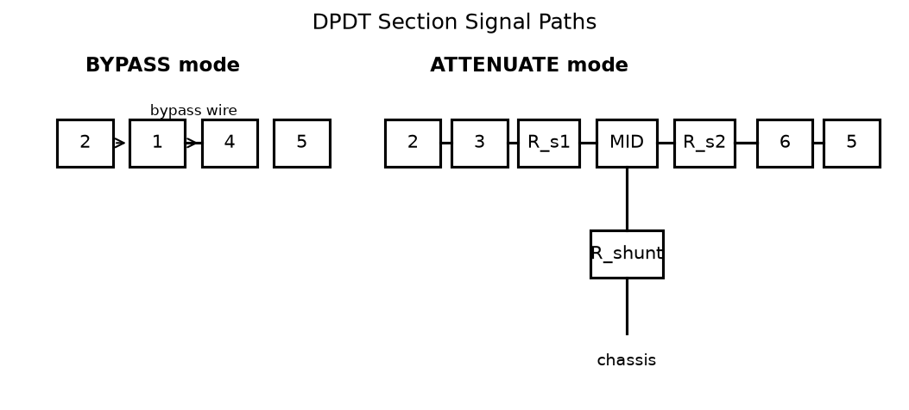

# ARDF Equipment Build Session — Syllabus

**Event:** Mike & Key ARC ARRL Field Day 2026
**Date:** Thursday, June 26, 2026 — 13:00–18:00 (proposed)
**Location:** Fort Flagler State Park — Wagon Wheel Group Campsite
**Instructor:** Tom KE4HET
**Support:** M&K ARC volunteers (TBD)

---

## Table of Contents

1. [Session Overview](#1-session-overview)
2. [Pre-Session Instructor Checklist](#2-pre-session-instructor-checklist)
3. [Project 1 — 2-Meter Tape Measure Yagi](#3-project-1--2-meter-tape-measure-yagi)
4. [Project 2 — Switched Step Attenuator](#4-project-2--switched-step-attenuator)
5. [Project 3 — Dual-Band (2m / 70cm) Tape Measure Yagi](#5-project-3--dual-band-2m--70cm-tape-measure-yagi)
6. [Testing and Verification](#6-testing-and-verification)
7. [Tools List](#7-tools-list)
8. [Timeline Summary](#8-timeline-summary)
9. [References](#9-references)

---

## 1. Session Overview

### Goals

Participants leave Thursday afternoon with two (or three) working
pieces of ARDF (Amateur Radio Direction Finding) equipment ready
to use at the demonstration on Saturday and Sunday:

- **Project 1:** 3-element 2m tape measure Yagi antenna
- **Project 2:** 3-section switched step attenuator
- **Project 3 (optional):** Dual-band 2m/70cm tape measure Yagi
  for participants with a dual-band HT and ~90 minutes of extra
  time after completing Projects 1 and 2.

The session is hands-on from the first minute. Instruction happens
at the bench, not the whiteboard. Every participant builds their
own kit.

### Audience

- Licensed amateur radio operators (any license class)
- 1–10 participants
- Assumed skill level: can solder, can use hand tools, can follow
  written instructions. Not beginners — treat them as capable adults.
- No prior antenna-building experience required.

### Context

The completed antennas and attenuators will be used by participants
and loaned to members of the public at the ARDF demonstration hosted
by Mike & Key ARC at Battery Grattan / Parade Grounds, Fort Flagler
State Park, Saturday June 28 and Sunday June 29, 2026.

### Location & Logistics

| Item | Notes |
|---|---|
| Site | Wagon Wheel group campsite, Fort Flagler State Park |
| Power | **Limited / none.** All tools must be battery or propane powered. No AC assumed. Plan accordingly. |
| Tables | Bring folding tables — 1 per 2 participants minimum |
| Shade | Bring a canopy or schedule session in natural shade |
| Weather | June on the Olympic Peninsula — prepare for wind and possible light rain |
| Noise | Campsite is shared — keep generator use minimal |

### Schedule at a Glance

| Time | Activity |
|---|---|
| 12:30 | Instructor arrives; stage all tools, kits, and tables |
| 13:00 | Welcome, safety brief, session overview (10 min) |
| 13:10 | **Project 1: Tape Measure Yagi** begins |
| 15:10 | Yagi complete; break (15 min) |
| 15:25 | **Project 2: Step Attenuator** begins |
| 17:15 | Attenuator complete |
| 17:15 | **Testing and verification** (30 min) |
| 17:45 | Wrap-up, Q&A, pack up (15 min) |
| 18:00 | Session ends |

**Total session duration: approximately 5 hours**

See [Section 8](#8-timeline-summary) for a step-by-step time budget.

---

## 2. Pre-Session Instructor Checklist

Complete these tasks before arriving on Thursday.

### Procurement (order at least 2 weeks in advance)

- [ ] Purchase all Project 1 (Yagi) materials — see BOM in Section 3
- [ ] Purchase all Project 2 (Attenuator) materials — see BOM in
      Section 4
- [ ] Purchase all Project 3 (Dual-Band Yagi) materials for
      participants who choose that option — see BOM in Section 5
- [ ] Pre-cut RG-58 coax to 6-foot lengths; crimp or solder one
      BNC-male connector on each length; label with masking tape
- [ ] Buy a backup set of each most-breakable item: extra BNC
      connectors, extra hose clamps, extra resistors
- [ ] Verify you have soldering irons for the expected headcount
      (minimum 1 iron per 2 participants)
- [ ] Charge all battery-powered tools
- [ ] Print this syllabus (one copy per participant + one instructor
      copy)

### Kit Preparation

Pre-sort materials into labeled zip-lock bags, one full kit per
participant. Label each bag with the participant's callsign or just
"Kit 1", "Kit 2", etc.

**Each Yagi kit bag contains:**
- 1× 25 ft tape measure (in original case)
- 2× ¾" PVC cross fitting
- 2× ¾" PVC T fitting
- 6× stainless hose clamps (½"–1¼")
- 1× 6 ft RG-58 pigtail with BNC-male (pre-built by instructor)
- 1× 6" piece of 14 AWG solid copper wire (pre-cut)
- Small piece of fine sandpaper (80–120 grit)
- 2 cable ties

**Each attenuator kit bag contains:**
- 3× DPDT ON-ON miniature toggle switch
- 2× BNC female panel-mount connector
- 1× small metal project box (Hammond 1590A or equivalent)
- Resistors (pre-sorted in a small envelope):
  - 2× 18 Ω, 1× 68 Ω  (6 dB section)
  - 2× 27 Ω, 1× 36 Ω  (10 dB section)
  - 2× 39 Ω, 1× 10 Ω  (20 dB section)
- 2× short pieces of hookup wire (~22–24 AWG, 3" each, for bypass
  wires)
- 1× small strip of perfboard (~1" × 3"), optional

**Each dual-band Yagi kit bag (Project 3 — optional add-on):**
- 2× ¾" PVC cross fitting (70cm reflector and driven element
  positions — same part as the 2m section, rotated 90° on boom)
- 1× ¾" PVC T fitting (70cm director — same part as 2m director,
  rotated 90° on boom)
- 6× additional stainless hose clamps (½"–1¼")
- 1× 3–6 ft RG-58 pigtail with BNC-male (70cm feed, pre-built)
- 1× 2" piece of 18–20 AWG solid copper wire (pre-cut; for 70cm
  hairpin match)
- 2× cable ties (coax routing)

**Shared supplies (instructor brings, not per-kit):**
- Solder (60/40 or 63/37 rosin-core, 0.032")
- Flux pen or rosin flux
- Electrical tape (2 rolls)
- Cable ties (bag)
- Wire strippers (instructor + 1–2 spares)
- Drill + ¼" and ½" bits (for attenuator enclosures)
- Denatured alcohol + cotton swabs (flux cleanup)
- Extra 14 AWG wire and RG-58 scraps for mistakes
- Masking tape + permanent marker (labeling)
- First aid kit

### Day-of Setup

- [ ] Set up tables with 18"–24" workspace per participant
- [ ] Place a cutting mat or piece of cardboard on each table (for
      hack-sawing and drilling)
- [ ] Set up one soldering station per 2 participants: iron, stand,
      tip cleaner, solder, flux, small fan for fume dispersal
- [ ] Lay out a kit bag and printed instruction sheet at each station
- [ ] Stage PVC pipe (cut to rough length or full 10 ft) for
      distribution; no separate ½" pipe needed for Project 3 —
      70cm fittings mount directly on the main ¾" boom
- [ ] Have the drill and enclosures ready at one central station for
      Project 2

---

## 3. Project 1 — 2-Meter Tape Measure Yagi

### Background

This is the classic 3-element tape measure Yagi popularized by Joel
Hartman WB2HOL for amateur ARDF (fox hunting). It has approximately
7 dBd of forward gain, a clean cardioid pattern with a pronounced
forward lobe, and a deep rear null useful for close-in signal bearing.

The antenna is cut for approximately 146 MHz (2-meter simplex/ARDF
frequencies). As a receive-only antenna for fox hunting, resonance
is not critical — a 2–3% variation in element length has negligible
effect on receive sensitivity or directional performance.

The spring-steel tape measure elements fold flat for transport and
spring back to shape for use. The PVC boom is light enough to wave
around one-handed for extended periods.

> **Assembly drawing:** See **`yagi-assembly.png`** (generated by
> `generate_yagi_assembly.py`) for a to-scale plan view of the finished
> antenna with all element lengths, boom spacings, and the driven-element
> feed/hairpin detail. Re-run the script after changing any dimension in
> this section to keep the drawing in sync.

### Bill of Materials — Yagi

> **Target cost:** ~$30–35 per kit when ordered in bulk for 10
> participants. Individual retail purchase: ~$38–45.

| Qty | Item | Notes | Est. Cost |
|-----|------|-------|-----------|
| 1 | 25 ft × 1" wide steel tape measure | Stanley, Craftsman, or similar. Must be at least 25 ft. **1" blade width is critical** — wider blades are too stiff; narrower won't tune correctly. | $6–10 |
| 1 | 10 ft length of ¾" Schedule 40 PVC pipe | Available at any hardware store. One 10 ft stick yields boom + handle for one kit with material to spare. | $4–6 |
| 2 | ¾" PVC cross (4-way) fittings | One for reflector position, one for driven element. | $1.50–3.00 each |
| 2 | ¾" PVC T fittings | One for director (front), one for handle grip (rear). | $0.75–1.50 each |
| 6 | Stainless steel hose clamps, ½"–1¼" range | Buy a 10-pack and split among kits. Must be worm-drive (screw-tighten), not spring-type. | ~$7–10/10-pack |
| 1 | RG-58/U coax pigtail, 6 ft, BNC-male one end | Pre-built by instructor. Or buy a 6 ft BNC-M–BNC-M jumper and cut one BNC off. | $4–7 |
| 1 | 14 AWG solid copper wire, 6" piece | Pre-cut. From a scrap of THHN or solid hookup wire. | <$0.50 |
| — | Rosin-core solder, 60/40 | Shared supply | — |
| — | Fine sandpaper, 80–120 grit | One small piece per kit | <$0.25 |
| — | Electrical tape | Shared supply | — |
| — | 2 cable ties | For coax routing | <$0.25 |

**Per-kit total (bulk purchasing): ~$30–36**

#### Sourcing Suggestions

- **Tape measures:** Home Depot or Lowe's in-store (~$6–8 for a basic
  Stanley or store brand). Alternatively, buy a 4-pack on Amazon for
  ~$20–24 ($5–6 each). Avoid "autolock" models — the blade needs to
  retract freely so you can slide it through the hose clamps.
- **PVC pipe and fittings:** Any hardware store, plumbing section.
  Buy fittings individually — cross fittings may not be in the "grab
  bag" section, look for individual ¾" DWV or pressure fittings.
- **Hose clamps:** Hardware store, automotive section. Buy a 10-pack.
  Specify "worm-drive" or "screw-type". Size range ½"–1¼" works;
  pack labeled "12–20 mm" or "5/16"–¾" will also fit ¾" PVC OD.
- **RG-58 pigtails:** Build from bulk RG-58 ($0.30/ft) + BNC crimp
  connectors ($0.80–1.50 each). Or buy pre-made 6 ft BNC jumpers on
  Amazon (search "6 ft RG-58 BNC cable", ~$5–8 each) and cut one
  connector off.

### Tools Required — Yagi

*(See also Section 7 for full tools list)*

| Tool | Notes |
|---|---|
| Tin snips or aviation shears | For cutting tape measure blade |
| PVC pipe cutter or fine-tooth handsaw | Ratchet-style PVC cutter is fastest |
| Measuring tape or ruler | One per participant |
| Screwdriver (flat) or ¼" nut driver | For hose clamp screws |
| Soldering iron (25–40 W) | One per 2 participants |
| Helping hands / alligator clip holder | Strongly recommended for driven element soldering |
| Fine sandpaper (80–120 grit) | Included in kit |
| Wire strippers | For coax prep |
| Needle-nose pliers | For bending hairpin wire |
| Permanent marker | For marking cut lines on tape measure |

---

### Step-by-Step Build Instructions — Yagi

> **Full step-by-step instructions, common mistakes, and testing
> procedures are in the standalone build document:**
>
> **[`build-instructions-2m-yagi.md`](build-instructions-2m-yagi.md)**
>
> Print one copy per participant. The document is self-contained
> and includes the BOM, all 10 build steps, a troubleshooting
> guide, and a quick-reference card.

---

## 4. Project 2 — Switched Step Attenuator

> **Feasibility note:** The attenuator adds approximately $22–28 per
> participant to the session cost, bringing the total kit cost to
> roughly $52–64 per person. This is modestly over the $50 target,
> but is achievable with bulk purchasing. The attenuator is strongly
> recommended — without it, the fox hunt becomes difficult as
> participants get close to the transmitter because the HT receiver
> front end is overloaded.

### Background

As you walk toward the fox, the received signal gets stronger. At
close range (within 100 ft) the signal can be so strong that the HT's
front end saturates, making the S-meter peg at maximum from every
direction. An attenuator sits between the antenna and the HT, reducing
the signal level so that meaningful directional null-finding remains
possible even at close range.

This design provides three independently switched attenuation
sections — 6 dB, 10 dB, and 20 dB. The sections can be combined in
any combination, giving 8 attenuation levels:

| Switches engaged | Attenuation |
|---|---|
| None | 0 dB (full signal) |
| 6 dB only | 6 dB |
| 10 dB only | 10 dB |
| 6 + 10 dB | 16 dB |
| 20 dB only | 20 dB |
| 6 + 20 dB | 26 dB |
| 10 + 20 dB | 30 dB |
| 6 + 10 + 20 dB | 36 dB |

### Circuit Description

Each section is a **T-type RF attenuator** (T-pad): two series
resistors with one shunt resistor to ground in the middle, designed
for a 50 Ω system. Each section is switched in or out of the signal
path by a DPDT ON-ON toggle switch.

**Full attenuator schematic (all 3 sections):**

*Blue arches = DPDT bypass path (switch in BYPASS position, signal
passes through). Black path = signal through T-pad (switch in
ATTENUATE position). Shunt resistors R2 connect mid-node to chassis
ground.*

When the toggle switch is in **bypass** position:
- Both switch commons are connected directly to each other via a
  short bypass wire (signal passes straight through, T-pad floats)

When the toggle switch is in **attenuate** position:
- Signal routes through both series resistors
- The shunt resistor connects the midpoint (MID) to chassis ground

**T-pad resistor values (50 Ω system, verified):**

| Section | R_series (each of 2) | R_shunt | Notes |
|---|---|---|---|
| 6 dB | **18 Ω** | **68 Ω** | Theoretical: 16.6 Ω / 66.9 Ω |
| 10 dB | **27 Ω** | **36 Ω** | Theoretical: 26.0 Ω / 35.1 Ω |
| 20 dB | **39 Ω** | **10 Ω** | Theoretical: 40.9 Ω / 10.1 Ω |

Standard E12 resistor values are used. Actual attenuation will be
within 0.5 dB of nominal at 2 meters — more than adequate for
fox hunting.

> **For transmit use:** All resistors must be rated ≥ 1 W. For
> receive-only fox hunting use, ¼ W is sufficient and much cheaper.

**DPDT switch wiring per section:**

| Pin | Connection |
|---|---|
| 2 (COM, Pole 1) | Signal IN from previous section or BNC IN |
| 5 (COM, Pole 2) | Signal OUT to next section or BNC OUT |
| 1 (Throw A, Pole 1) | → short bypass wire → Pin 4 |
| 4 (Throw A, Pole 2) | ← short bypass wire ← Pin 1 |
| 3 (Throw B, Pole 1) | → R_series1 → MID node |
| 6 (Throw B, Pole 2) | ← R_series2 ← MID node |
| MID node | → R_shunt → chassis (GND) |

> **BYPASS mode (switch to throw A):** Pins 1–2 connected, 4–5
> connected. The bypass wire (1→4) links both poles → signal goes
> directly from pin 2 to pin 5. The T-pad resistors are floating.

> **ATTENUATE mode (switch to throw B):** Pins 2–3 connected, 5–6
> connected. Signal goes 2→3→R_s1→MID→R_s2→6→5. R_shunt connects
> MID to chassis ground.

**Three sections are wired in series:** The output of one section
(pin 5) feeds directly to the input of the next section (pin 2).

### Bill of Materials — Attenuator

> **Target cost:** ~$22–28 per kit when ordered in bulk.

| Qty | Item | Notes | Est. Cost |
|-----|------|-------|-----------|
| 3 | DPDT ON-ON miniature toggle switch, PCB or solder-lug terminals | 6-pin, ON-ON (not ON-OFF-ON). Bushing diameter typically 6 mm or ¼". | $1.50–2.50 each |
| 2 | BNC female panel-mount (chassis-mount) connector | Bulkhead type. Thread-mount, ⅜" or ½" panel hole. | $1.50–2.50 each |
| 1 | Metal project enclosure, approx. 3.7" × 2.9" × 1.2" | Hammond 1590A (die-cast aluminum) or equivalent. **Must be metal** for RF shielding. | $10–14 |
| 2 | 18 Ω ¼ W metal film resistor | For 6 dB section | < $0.25 total |
| 1 | 68 Ω ¼ W metal film resistor | For 6 dB section | < $0.25 total |
| 2 | 27 Ω ¼ W metal film resistor | For 10 dB section | < $0.25 total |
| 1 | 36 Ω ¼ W metal film resistor | For 10 dB section | < $0.25 total |
| 2 | 39 Ω ¼ W metal film resistor | For 20 dB section | < $0.25 total |
| 1 | 10 Ω ¼ W metal film resistor | For 20 dB section | < $0.25 total |
| — | 22–24 AWG hookup wire, ~12" | Short runs inside enclosure | Shared |
| — | Solder | Shared | — |

**Per-kit total (bulk purchasing): ~$22–28**

> **Resistor sourcing:** Buy an assortment kit from Amazon (500-piece
> or 1000-piece metal film assortment, ~$8–12) and pull the values
> you need. Or order from Digi-Key / Mouser; at small quantities, a
> resistor costs $0.08–0.15 each. For 10 participant kits, you need
> 20× 18 Ω, 10× 68 Ω, 20× 27 Ω, 10× 36 Ω, 20× 39 Ω, 10× 10 Ω.

> **BNC connectors:** 10-pack on Amazon is ~$8–10. Leftover connectors
> are useful for future projects.

> **Hammond 1590A alternative:** Any die-cast or stamped-steel box
> in the 3"–4" range works. Plastic boxes are NOT acceptable — they
> provide no RF shielding and the attenuator will behave poorly.
> "Project box" listings on Amazon that say "aluminum" are usually
> acceptable; "ABS" or "polycarbonate" are not.

#### Sourcing Suggestions

- **Switches:** Amazon search "DPDT ON-ON mini toggle switch 6 pin"
  — buy a 10-pack (~$8–12) so you have spares. Confirm they are
  ON-ON (not ON-OFF-ON, which has 3 positions).
- **BNC connectors:** Amazon, Digi-Key, Mouser. Search "BNC female
  panel mount" or "BNC chassis mount". Buy a 10-pack.
- **Enclosures:** Hammond 1590A from Amazon, Digi-Key, or Mouser
  (~$10–12 each). Order in advance; this is the longest-lead item.
- **Resistors:** 1% metal film assortment kit from Amazon (~$8–12 for
  500-piece kit). Confirm the kit includes 10 Ω, 18 Ω, 27 Ω, 36 Ω,
  39 Ω, 68 Ω. Most 600-value kits include these.

### Tools Required — Attenuator

| Tool | Notes |
|---|---|
| Electric drill with bits | ⅜" or ½" bit for BNC holes; ¼" bit for toggle switch holes. One drill handles the whole group. |
| Drill bit sizes | Verify against your specific BNC and switch hardware before drilling |
| Step drill ("unibit") | Optional — makes cleaner holes in thin aluminum than twist bits |
| Round file or needle file | Deburring drill holes in the enclosure |
| Soldering iron (25–40 W) | Same iron as used for the Yagi |
| Small flat screwdriver | For tightening BNC and switch hardware |
| Ohmmeter / continuity tester | **Essential for verifying wiring before closing the box** |
| Needle-nose pliers | For bending resistor leads |
| Masking tape + permanent marker | Labeling the switches |

---

### Step-by-Step Build Instructions — Attenuator

> **Full step-by-step instructions, common mistakes, and testing
> procedures are in the standalone build document:**
>
> **[`build-instructions-attenuator.md`](build-instructions-attenuator.md)**
>
> Print one copy per participant. The document is self-contained
> and includes the schematic, BOM, all 9 build steps, a
> troubleshooting guide, and a quick-reference card.

---

## 5. Project 3 — Dual-Band (2m / 70cm) Tape Measure Yagi

> **Optional advanced project.** Build this if you want a single
> antenna that covers both 2-meter and 70-cm ARDF bands. It adds
> roughly 60–90 minutes to the build time and requires a dual-band
> HT and a second coax pigtail.

### Overview

This project adds a 3-element 70cm Yagi to the 2m Yagi built in
Project 1, creating a dual-band directional antenna with two
independent coax feeds. The 70cm fittings are ¾" PVC (same size
as the 2m section) placed on the same boom, rotated 90° so the
70cm elements are horizontal when the 2m elements are vertical.
Useful for events running foxes on both 2m and 70cm simultaneously.

### Full Build Instructions

> **Step-by-step instructions, BOM, and testing procedures are in
> the standalone build document:**
>
> **[`build-instructions-dual-band-yagi.md`](build-instructions-dual-band-yagi.md)**
>
> Print one copy per participant choosing this project.

### Bill of Materials — Project 3 Add-On

> **Target cost:** ~$14–20 per kit in addition to the Project 1
> Yagi kit (~$46–56 total). This is the incremental cost for the
> 70cm section only; the 25 ft tape measure and main boom are
> shared with Project 1.

| Qty | Item | Notes | Est. Cost |
|-----|------|-------|-----------|
| 2 | ¾" PVC cross (4-way) fittings | Reflector and driven element positions. Rotated 90° on main boom. Same part as Project 1. | $1.50–3.00 each |
| 1 | ¾" PVC T fitting | Director position. Rotated 90° on main boom. Same part as Project 1. | $0.75–1.50 |
| 6 | Stainless steel hose clamps, ½"–1¼" | Same size as Project 1 clamps. | ~$3–5 (from shared pack) |
| 1 | RG-58/U coax pigtail, 3–6 ft, BNC-male | 70cm feed. Pre-built by instructor. | $3–6 |
| 1 | 18–20 AWG solid copper wire, 2" piece | 70cm hairpin match. Pre-cut. | <$0.25 |
| 2 | Cable ties | Coax routing. | <$0.25 |

**Incremental add-on cost: ~$12–18 per kit**

### 70cm Element and Fitting Dimensions (Quick Reference)

| Element | Length |
|---|---|
| Reflector | **13¾"** |
| Driven element (each half) | **5⅞"**, gap = **⅜"** |
| Director | **11⅝"** |

All 70cm fittings are ¾" PVC on the main boom, rotated 90°.

| Fitting position from handle | Fitting | Orientation |
|---|---|---|
| ~23" | 70cm Reflector cross | 90° rotated |
| ~27⅛" | 70cm Driven cross | 90° rotated |
| ~29¾" | 70cm Director T | 90° rotated |

---

## 6. Testing and Verification

All testing takes place with equipment that can be brought to the
campsite. No lab instruments are required.

### 6.1 Yagi — Continuity Test (5 minutes per antenna)

Equipment: Ohmmeter or DMM in continuity/resistance mode.

1. **Center-to-braid short check:** Probe BNC-male center pin and
   BNC-male shell. Expect: **open** (infinite resistance, no
   continuity). If you read continuity, there is a short in the
   coax, at the BNC connector, or at the driven element. Do not
   proceed until this is resolved.

2. **Driven element wiring:** Probe BNC center pin while touching
   one driven element half with the other probe. Expect: very low
   resistance (< 2 Ω) — this verifies the coax center conductor is
   connected to the element.

3. **Braid-to-element continuity:** Probe BNC shell to the OTHER
   driven element half. Expect: very low resistance (< 2 Ω).

4. **Check hairpin:** With the ohmmeter probes on the two driven
   element halves (the ones with the driven element), expect low
   resistance through the hairpin wire (the two element halves ARE
   connected by the hairpin, so they'll read a low resistance, and
   the coax center/braid are also connected to them — the key is that
   center and shell remain isolated from each other).

   > Note: When probing center vs. shell through the antenna, you will
   > see some resistance (the hairpin and element loops), but a true
   > short (0 Ω) indicates a coax or solder bridge fault.

### 6.2 Attenuator — Bench Test (10 minutes per unit)

Equipment: Ohmmeter or DMM.

**With ALL switches in bypass:**
- BNC IN center → BNC OUT center: near 0 Ω (< 2 Ω) ✓
- BNC IN shell → BNC OUT shell: near 0 Ω ✓
- BNC IN center → BNC IN shell: open ✓

**With 6 dB section switched in (others bypass):**
- BNC IN → BNC OUT: should read approximately 5–15 Ω  
  (not an exact attenuator measurement with a DMM — just verifies
  the resistors are in circuit)

**With all sections switched in:**
- BNC IN → BNC OUT: measurably higher resistance than above ✓

> **Precision testing:** A proper 50 Ω attenuator cannot be accurately
> tested with a DMM alone. The resistors are in a 50 Ω network; DC
> resistance readings will not tell you the RF attenuation value
> exactly. What you're confirming is that the resistors are physically
> present and connected, not that the attenuation is precisely 6 dB.

### 6.3 Functional RF Test (15 minutes for the group)

This is the real test. Use a 2-meter HT and a nearby repeater or
beacon, or another participant's HT transmitting briefly.

**Yagi test:**
1. Connect the Yagi to an HT via its BNC pigtail.
2. Identify a signal source: a repeater on a known frequency is ideal,
   or another HT held ~50 ft away.
3. Point the Yagi's director (front T connector) at the signal source.
   The S-meter should read higher than with the rubber duck antenna.
4. Rotate the antenna 180° (director away from signal). The S-meter
   should drop noticeably — this is the rear null. A working Yagi
   will show 15–20+ dB front-to-back difference.
5. Slowly rotate the antenna. The signal should be strongest on axis
   with the director and weakest behind the reflector.

> **Tip:** If the antenna shows no directional difference, check for
> a coax center-to-braid short. An omni pattern usually indicates
> the coax is shorted or disconnected at the driven element.

**Attenuator test:**
1. Connect the Yagi to the attenuator IN, attenuator OUT to the HT.
2. With all switches in bypass, observe the S-meter with the Yagi
   pointed at the signal source.
3. Switch in the 20 dB section. The S-meter should drop approximately
   3–5 S-units (at 6 dB per S-unit, 20 dB ≈ 3.3 S-units).
4. Switch in the 10 dB section additionally. Another 1–2 S-unit drop.
5. Switch in the 6 dB section for maximum attenuation. Another
   fractional S-unit drop.

> **Tip:** S-meter calibration on HTs is notoriously non-linear and
> varies by model. Don't expect exactly 3.33 S-units per 20 dB. What
> you're confirming is that:
> (a) each switch causes the signal to decrease when engaged, and
> (b) the decreases are additive.

---

## 7. Tools List

### Instructor Must Bring (bring all of these)

| Tool | Qty | Notes |
|---|---|---|
| Soldering irons, 25–40 W | 2–5 | One per 2 participants. Battery-powered models (e.g., TS100 with 20V battery, or Pinecil) are ideal for no-AC sites |
| Soldering iron stands | 1 per iron | Coil spring type; safe for outdoor tables |
| Tip cleaner (brass wool) | 1 per iron | Better than wet sponge outdoors |
| Solder, 60/40 rosin core, 0.032" | 2 spools | |
| Flux pen (rosin flux) | 2 | |
| DMM / ohmmeter | 2 | For testing each finished build |
| Tin snips / aviation shears | 2–3 | Shared; one per 3–4 participants |
| PVC pipe cutter (ratchet style) | 2 | |
| Fine-tooth handsaw | 1 | Backup for PVC cutting |
| Cutting mat / scrap plywood | 2–3 | Bench protection |
| Measuring tapes, 12"+ | 3–4 | |
| Permanent markers | 4–5 | |
| Masking tape | 2 rolls | |
| Wire strippers, 22–18 AWG | 2–3 | |
| Needle-nose pliers | 3–4 | |
| Flat screwdrivers, small | 3–4 | Hose clamps + BNC/switch hardware |
| ¼" nut driver or 5.5 mm socket + handle | 2 | For hose clamps |
| Electric drill (cordless) | 1 | Fully charged |
| Drill bits: ⅛", ¼", ⅜", ½" | 1 set | For attenuator enclosures |
| Step drill bit (unibit) | 1 | Optional; improves aluminum hole quality |
| Round needle file | 2 | Deburring holes |
| Helping hands (alligator clip soldering aid) | 2–4 | |
| Small fan or folded cardboard | 2 | Flux fume dispersal |
| Denatured alcohol + cotton swabs | 1 bottle, 20 swabs | Flux cleanup |
| First aid kit | 1 | Tin snips and irons cause injuries |
| Nitrile gloves | 10 pairs | Optional; for those who prefer |
| Safety glasses | 5–10 pairs | Cutting springs can cause flying debris |
| Folding tables, 6 ft | 2–3 | 1 per 2–3 participants |
| Canopy / EZ-up | 1 | Sun and rain cover |
| Extension cord (12 ft) | 1 | If any AC power is available nearby |
| Printed syllabus copies | N + 2 extras | One per participant + instructor copies |
| Zip-lock bags (quart) | Several | Spare parts, hardware sorting |
| Trash bag | 2 | Cleanup |

### Participants Should Bring (if possible)

| Item | Notes |
|---|---|
| Their own HT (2-meter) | For functional RF testing |
| BNC adapter for their HT | If HT uses SMA or other connector |
| Their own multimeter/DMM | Speeds up testing if multiple units available |
| Their own soldering iron | If they have a good travel iron |
| Safety glasses | |
| Work gloves | For tin snips work |
| Snacks, water | This is a 5-hour outdoor session |

---

## 8. Timeline Summary

The table below shows the complete session timeline with realistic
time estimates. "Fast" assumes an experienced group working smoothly;
"slow" assumes first-time builders with questions. With a mixed group
of 1–10, expect times between these bounds.

| Step | Activity | Fast | Slow |
|---|---|---|---|
| — | Arrival, settle in, distribute kits | 5 min | 10 min |
| **Project 1: Yagi** | | | |
| 0 | Intro: review plan, inspect parts | 5 min | 10 min |
| 1 | Cut PVC boom pieces | 10 min | 20 min |
| 2 | Dry-fit PVC frame, verify spacing | 8 min | 15 min |
| 3 | Cut tape measure elements | 15 min | 25 min |
| 4 | Sand and tin driven element tips | 10 min | 20 min |
| 5 | Mount reflector and director | 8 min | 15 min |
| 6 | Mount driven element halves | 8 min | 15 min |
| 7 | Fabricate and attach hairpin | 10 min | 20 min |
| 8 | Prepare coax pigtail (bare end) | 8 min | 15 min |
| 9 | Solder coax to driven element | 8 min | 15 min |
| 10 | Route coax, final assembly | 7 min | 12 min |
| **Project 1 subtotal** | | **~97 min** | **~167 min** |
| — | **Break** | 15 min | 15 min |
| **Project 2: Attenuator** | | | |
| 1 | Review schematic, inspect parts | 8 min | 15 min |
| 2 | Plan, mark, drill enclosure | 12 min | 20 min |
| 3 | Install BNC connectors | 8 min | 12 min |
| 4 | Install toggle switches | 8 min | 12 min |
| 5 | Wire bypass connections | 10 min | 18 min |
| 6 | Build and solder T-pad networks | 20 min | 35 min |
| 7 | Wire sections in series | 10 min | 18 min |
| 8 | Verify with ohmmeter | 8 min | 15 min |
| 9 | Close and label enclosure | 5 min | 8 min |
| **Project 2 subtotal** | | **~89 min** | **~153 min** |
| — | **Testing and verification** | 20 min | 35 min |
| — | **Wrap-up, Q&A, cleanup** | 15 min | 20 min |
| **Total session (P1 + P2)** | | **~4 hr 0 min** | **~6 hr 40 min** |
| — | *Optional: Project 3 add-on (dual-band Yagi)* | | |
| 11 | *Mark 70cm positions and dry-fit fittings at 90°* | *10 min* | *20 min* |
| 12 | *Cut 70cm tape measure elements* | *15 min* | *25 min* |
| 13–18 | *Prep tips, mount elements, hairpin, coax* | *35 min* | *60 min* |
| 19–20 | *Verify 90° orientation, route coax, label* | *10 min* | *20 min* |
| **Project 3 subtotal (if pursued)** | | **~70 min** | **~125 min** |

### Recommended Session Plan

**Start: 13:00 (1:00 PM)**
**Buffer break if needed: ~15:00 or after Yagi completion**
**End: 17:30–18:00 (5:30–6:00 PM)**

**Proposed total duration: 5 hours.** This is between fast and slow,
with buffer for questions, equipment issues, and the realities of
an outdoor campsite. With 1–2 participants, the session may finish
in 4 hours. With 8–10 participants all building simultaneously, plan
for 5.5 hours.

#### Instructor Pacing Notes

- If the group is falling behind at the halfway point (Yagi should
  be complete by 15:10), shorten Break or combine Steps 8–10 as a
  group demo rather than individual builds.
- If time is very short, prioritize the Yagi. A working directional
  antenna without an attenuator is still functional for the ARDF
  demo. An attenuator without an antenna is useless.
- If time permits and all attenuators are done by 17:00, conduct a
  group field walk: take one HT + Yagi + attenuator to the Parade
  Grounds and practice bearing runs on the Byonics fox transmitter.
  This is the best possible preparation for Saturday.
- If any participants have extra time and a dual-band HT, walk them
  through Project 3 (dual-band Yagi). The 70cm section takes
  60–90 minutes and produces an antenna ready for 70cm fox hunts
  or future dual-band events.

---

## 9. References

| Source | Description |
|---|---|
| jpole-antenna.com, 2017 | Primary build reference for Yagi dimensions and assembly: [https://www.jpole-antenna.com/2017/02/07/build-it-2-meter-tape-measure-yagi-beam-antenna/](https://www.jpole-antenna.com/2017/02/07/build-it-2-meter-tape-measure-yagi-beam-antenna/) |
| WB2HOL (Joel Hartman) | Original designer of the tape measure Yagi for ARDF. Original page offline; widely reproduced online. Dimensions used in this syllabus derive from his published design. |
| ARDF.net | General ARDF resources, fox hunting techniques: [https://www.ardf.net](https://www.ardf.net) |
| Homingin.com | ARDF equipment reviews and designs: [https://www.homingin.com](https://www.homingin.com) |
| Chemandy Electronics | RF attenuator calculator (T-pad and pi-pad): [https://www.chemandy.com/calculators/](https://www.chemandy.com/calculators/) |
| ARRL Handbook | Chapter on transmission lines and matching networks; T-pad attenuator design formulas |
| M&K ARC Field Day 2026 — Overall Plan | `docs/field-day-2026/overall-plan.md` in this repository |
| Build Instructions — 2m Yagi | `docs/field-day-2026/build-instructions-2m-yagi.md` |
| Build Instructions — Switched Step Attenuator | `docs/field-day-2026/build-instructions-attenuator.md` |
| Build Instructions — Dual-Band (2m/70cm) Yagi | `docs/field-day-2026/build-instructions-dual-band-yagi.md` |

---

## Appendix A — Quick Reference Card

*Print this page and laminate it. Tape one to each participant's
workstation.*

### Yagi Element Lengths

| Element | Cut Length |
|---|---|
| Reflector | **41⅜"** |
| Driven element (each half) | **17¾"** |
| Director | **35⅛"** |

### Yagi Boom Spacing (center-to-center)

| Span | Distance |
|---|---|
| Director T ↔ Driven element cross | **~8"** (Boom-B tube = 6⅞") |
| Driven element cross ↔ Reflector cross | **~12½"** (Boom-A tube = 11¼") |

### 70cm Element Lengths (Project 3 — dual-band add-on)

| Element | Cut Length |
|---|---|
| Reflector | **13¾"** |
| Driven element (each half) | **5⅞"** (gap = ⅜") |
| Director | **11⅝"** |

### 70cm Fitting Positions on Main Boom (Project 3)

All ¾" PVC fittings — rotated 90° (70cm elements horizontal):

| Fitting | Position from handle |
|---|---|
| 70cm Reflector cross | ~23" |
| 70cm Driven cross | ~27⅛" |
| 70cm Director T | ~29¾" |

### Attenuator Resistor Values

| Section | Switch label | R_series (×2) | R_shunt (×1) |
|---|---|---|---|
| A | 6 dB | 18 Ω | 68 Ω |
| B | 10 dB | 27 Ω | 36 Ω |
| C | 20 dB | 39 Ω | 10 Ω |

### DPDT Switch Wiring Summary

---

## Appendix B — Troubleshooting Quick Guide

| Symptom | Likely Cause | Fix |
|---|---|---|
| **Yagi:** Antenna is omni-directional (no front-back difference) | Coax center shorted to braid at driven element | Remove tape, visually inspect solder joints; check with ohmmeter |
| **Yagi:** No signal on receive at all | Coax center conductor disconnected | Probe BNC center pin → driven element half; repair joint |
| **Yagi:** Weak signal, poor performance | Element lengths off by more than ½" | Re-measure and trim or replace elements |
| **Yagi:** Elements rotate under load | Hose clamps too loose | Re-tighten; clamp should grip tape blade firmly |
| **Attenuator:** Signal doesn't change with switches | Bypass wires on wrong throw; signal bypasses all sections | Verify bypass wires are on throw-A, not throw-B |
| **Attenuator:** Signal drops even when all in bypass | R_series wired to COM pins instead of throw-B | Trace each signal path with ohmmeter in bypass mode |
| **Attenuator:** One section doesn't attenuate | R_shunt not grounded; resistor not soldered | Check ground connection to chassis; re-solder R_shunt |
| **Attenuator:** Intermittent behavior | Switch not seating fully in throw positions | Verify switch hardware is tight in enclosure; check for wobble |
| **Dual-band Yagi:** 70cm section omni-directional | Coax center shorted to braid at 70cm driven element | Inspect 70cm solder joints; probe with ohmmeter |
| **Dual-band Yagi:** No 70cm receive at all | 70cm coax center disconnected | Probe 70cm BNC center → 70cm driven element half |
| **Dual-band Yagi:** Antenna looks crooked | Sub-boom skewed relative to main boom | Re-position and re-cinch zip ties until parallel |
| **Dual-band Yagi:** 2m pigtail and 70cm pigtail mixed up | Connected wrong HT to wrong coax | Label both ends of each pigtail before leaving the bench |

---

*Syllabus version: 1.0 — drafted for Field Day 2026.*
*Instructor: Tom KE4HET / Mike & Key ARC (K7LED)*
*Last updated: June 2026 (pre-event draft)*
