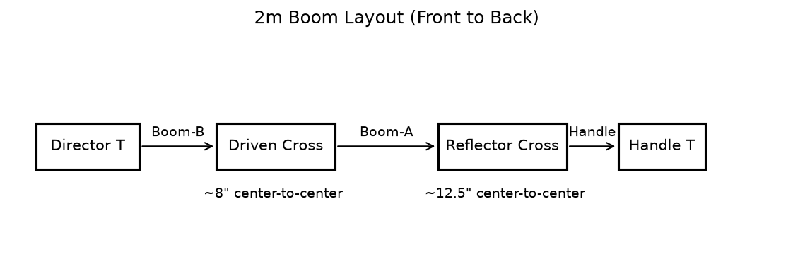
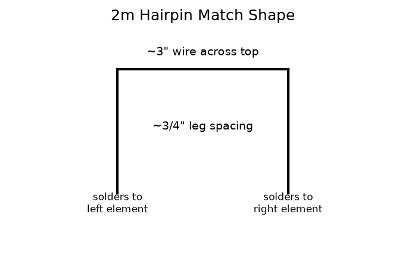

# Build Instructions — 2-Meter Tape Measure Yagi

**Project:** 3-element tape measure Yagi for 2m ARDF (146 MHz)
**Event:** M&K ARC ARRL Field Day 2026 — Fort Flagler
**Instructor:** Tom KE4HET
**Version:** 1.0 (pre-event draft)

---

## Table of Contents

1. [Background](#1-background)
2. [Bill of Materials](#2-bill-of-materials)
3. [Tools Required](#3-tools-required)
4. [Step-by-Step Build Instructions](#4-step-by-step-build-instructions)
5. [Common Mistakes and Tips](#5-common-mistakes-and-tips)
6. [Testing and Verification](#6-testing-and-verification)
7. [References](#7-references)

---

## 1. Background

This is the classic 3-element tape measure Yagi popularized by Joel
Hartman WB2HOL for amateur ARDF (fox hunting). It has approximately
7 dBd of forward gain, a clean cardioid pattern with a pronounced
forward lobe, and a deep rear null useful for close-in signal bearing.

The antenna is cut for approximately 146 MHz (2-meter
simplex/ARDF frequencies). As a receive-only antenna for fox
hunting, resonance is not critical — a 2–3% variation in element
length has negligible effect on receive sensitivity or directional
performance.

The spring-steel tape measure elements fold flat for transport and
spring back to shape for use. The PVC boom is light enough to wave
around one-handed for extended periods.

> **Assembly drawing:** See **`yagi-assembly.png`** (generated by
> `generate_yagi_assembly.py`) for a to-scale plan view of the finished
> antenna with all element lengths, boom spacings, and the
> driven-element feed/hairpin detail. Re-run the script after changing
> any dimension in this document to keep the drawing in sync.

---

## 2. Bill of Materials

> **Target cost:** ~$30–35 per kit when ordered in bulk for 10
> participants. Individual retail purchase: ~$38–45.

| Qty | Item | Notes | Est. Cost |
|-----|------|-------|-----------|
| 1 | 25 ft × 1" wide steel tape measure | Stanley, Craftsman, or similar. Must be at least 25 ft. **1" blade width is critical** — wider blades are too stiff; narrower won't tune correctly. | $6–10 |
| 1 | 10 ft length of ¾" Schedule 40 PVC pipe | Available at any hardware store. One 10 ft stick yields boom + handle for one kit with material to spare. | $4–6 |
| 2 | ¾" PVC cross (4-way) fittings | One for reflector position, one for driven element. | $1.50–3.00 each |
| 2 | ¾" PVC T fittings | One for director (front), one for handle grip (rear). | $0.75–1.50 each |
| 6 | Stainless steel hose clamps, ½"–1¼" range | Buy a 10-pack and split among kits. Must be worm-drive (screw-tighten), not spring-type. | ~$7–10/10-pack |
| 1 | RG-58/U coax pigtail, 6 ft, BNC-male one end | Pre-built by instructor. Or buy a 6 ft BNC-M–BNC-M jumper and cut one BNC off. | $4–7 |
| 1 | 14 AWG solid copper wire, 6" piece | Pre-cut. From a scrap of THHN or solid hookup wire. | <$0.50 |
| — | Rosin-core solder, 60/40 | Shared supply | — |
| — | Fine sandpaper, 80–120 grit | One small piece per kit | <$0.25 |
| — | Electrical tape | Shared supply | — |
| — | 2 cable ties | For coax routing | <$0.25 |

**Per-kit total (bulk purchasing): ~$30–36**

### Sourcing Suggestions

- **Tape measures:** Home Depot or Lowe's in-store (~$6–8 for a
  basic Stanley or store brand). Alternatively, buy a 4-pack on
  Amazon for ~$20–24 ($5–6 each). Avoid "autolock" models — the
  blade needs to retract freely so you can slide it through the hose
  clamps.
- **PVC pipe and fittings:** Any hardware store, plumbing section.
  Buy fittings individually — cross fittings may not be in the
  "grab bag" section, look for individual ¾" DWV or pressure
  fittings.
- **Hose clamps:** Hardware store, automotive section. Buy a
  10-pack. Specify "worm-drive" or "screw-type". Size range
  ½"–1¼" works; pack labeled "12–20 mm" or "5/16"–¾" will also
  fit ¾" PVC OD.
- **RG-58 pigtails:** Build from bulk RG-58 ($0.30/ft) + BNC crimp
  connectors ($0.80–1.50 each). Or buy pre-made 6 ft BNC jumpers on
  Amazon (search "6 ft RG-58 BNC cable", ~$5–8 each) and cut one
  connector off.

---

## 3. Tools Required

| Tool | Notes |
|---|---|
| Tin snips or aviation shears | For cutting tape measure blade |
| PVC pipe cutter or fine-tooth handsaw | Ratchet-style PVC cutter is fastest |
| Measuring tape or ruler | One per participant |
| Screwdriver (flat) or ¼" nut driver | For hose clamp screws |
| Soldering iron (25–40 W) | One per 2 participants |
| Helping hands / alligator clip holder | Strongly recommended for driven element soldering |
| Fine sandpaper (80–120 grit) | Included in kit |
| Wire strippers | For coax prep |
| Needle-nose pliers | For bending hairpin wire |
| Permanent marker | For marking cut lines on tape measure |
| Ohmmeter or DMM | For continuity verification |

---

## 4. Step-by-Step Build Instructions

> **Before you start:** Lay out all parts and verify against the
> BOM. Read through all steps before picking up any tools.

---

### Step 1 — Cut the PVC Boom Pieces

**Time: 15 minutes**

Cut the 10 ft PVC stick into the following pieces using a PVC
cutter or fine-tooth saw. Label each piece with masking tape as
you cut.

| Label | Length | Purpose |
|---|---|---|
| **Boom-A** | 11¼" (11.25") | Reflector cross ↔ driven element cross |
| **Boom-B** | 6⅞" (6.875") | Driven element cross ↔ director T |
| **Handle** | 14–18" | Operator handle (cut to preference) |

> **Tip:** Deburr the cut ends with sandpaper or a utility knife so
> the pipe slides fully into the fittings. A rough cut end can
> prevent the pipe from seating properly.

> **PVC cutter tip:** Score around the pipe once with light
> pressure, then increase pressure on each revolution. The
> ratchet-style cutter makes cleaner cuts with less effort than a
> hacksaw.

---

### Step 2 — Dry-Fit the PVC Frame

**Time: 10 minutes**

Assemble the boom WITHOUT glue (dry fit only). The design works
correctly without PVC cement — the fit is snug enough for field
use.

**Boom layout, front to back:**

1. Push Boom-B into one socket of the director T fitting (front).
2. Push the other end of Boom-B into one socket of the driven
   element cross fitting (center).
3. Push Boom-A into the opposite socket of the driven element
   cross.
4. Push the other end of Boom-A into one socket of the reflector
   cross fitting (rear).
5. Push the Handle piece into the fourth socket of the reflector
   cross (pointing toward the operator).
6. Push the Handle T fitting onto the far end of the Handle piece
   for a T-grip.

The boom should look like this from above (elements will be
horizontal, perpendicular to the boom):

> **Verify spacing:** With the boom assembled, measure
> center-to-center from the director T to the driven element
> cross. This should be ~8". From the driven element cross to the
> reflector cross should be ~12½". If your measurements are off,
> check that the pipe is seated fully into each fitting.

> **Do NOT glue yet.** You may need to disassemble to route the
> coax through the boom in Step 9.

---

### Step 3 — Cut the Tape Measure Elements

**Time: 20 minutes**

Cut the tape measure blade into the following pieces using tin
snips. Measure carefully — cut a little long first and trim to
final length. Mark each cut line with a permanent marker before
cutting.

| Element | Length | Quantity |
|---|---|---|
| Reflector | **41⅜"** (41.375") | 1 piece |
| Driven element half (×2) | **17¾"** (17.75") each | 2 pieces |
| Director | **35⅛"** (35.125") | 1 piece |

**Total tape measure consumed per kit: ~112" (9 ft 4 in).
One 25 ft tape yields two complete sets of elements (225" total
used, 75" remaining).**

#### Tape Blade Cut Marks

Mark **all cut points at once** while the blade is fully
extended, then cut in order. The first inch of Kit 1 is
discarded (hook end). Kit 2 starts clean at the 113" cut with
no scrap needed.

| Cut # | Kit 1 mark | Kit 2 mark | Piece produced | Length |
|-------|-----------|-----------|----------------|--------|
| 1 | **1"** | *(start at 113")* | Scrap — Kit 1 only | — |
| 2 | **42⅜"** | **154⅜"** | Reflector | 41⅜" |
| 3 | **77½"** | **189½"** | Director | 35⅛" |
| 4 | **95¼"** | **207¼"** | Driven element half A | 17¾" |
| 5 | **113"** | **225"** | Driven element half B | 17¾" |

Lay the extended blade on a flat cutting mat, mark all cut lines,
then cut in order. Label each piece immediately after cutting
(masking tape + marker works well).

> **Cutting safety:** Tin snips leave sharp edges. Wear gloves or
> work carefully. Immediately deburr cut ends by running a piece
> of sandpaper across the edge twice, or fold the cut end over
> briefly with pliers to dull the corner.

> **Measuring tip:** The tape measure blade IS the ruler. Extend
> the blade, mark the cut points with a marker while it's still
> extended, then lay it on a flat surface (cutting mat) to cut.
> Don't try to cut in mid-air.

> **Common mistake:** Cutting the driven element halves too short.
> The 1" gap between the two halves is in addition to each half's
> length. Total driven element length = 17¾" + 1" gap + 17¾"
> = 36½".

---

### Step 4 — Prepare the Driven Element Tips

**Time: 15 minutes — this is the most important soldering prep
step.**

The two driven element halves need to be tinned at their inner
ends (the ends that will face each other with the 1" gap). This
is much easier to do before mounting the elements.

1. Sand the **painted/chrome side** of the inner corner of each
   driven element half. Sand an area about ½" × ½" at the inner
   tip. The goal is bare, shiny steel — no paint, no chrome, no
   oxidation. The blade's reverse (dull) side may sand easier;
   check which side has less coating.

   > **Why the corner?** The hose clamps will grip the blade flat.
   > The soldering connection goes at the corner of the blade tip
   > so the coax and hairpin wire attach there while the clamp
   > holds the element flat and centered.

2. Apply a small drop of rosin flux to each sanded area.

3. Touch the soldering iron to the sanded/fluxed area for 3–5
   seconds to heat the metal, then apply a small amount of
   solder. The solder should flow onto the steel blade and stick
   (tin the surface).

   > **The steel blade is a heat sink.** You need a hot iron (at
   > least 700°F / 370°C tip temperature) and patience. Hold the
   > iron still for several seconds before applying solder. If the
   > solder beads up and rolls off, the metal isn't hot enough
   > yet.

4. Repeat for the second driven element half.

5. Set both tinned halves aside — they will cool quickly. The
   tinned area should look silver and smooth, not blobby.

---

### Step 5 — Mount the Reflector and Director Elements

**Time: 10 minutes**

1. Slide the reflector element (41⅜") through the two opposing
   arms of the **reflector cross** fitting (the rear cross on the
   boom). Center the element so equal lengths stick out on each
   side.

2. With the element centered, secure it with two hose clamps —
   one on each side of the fitting. The clamp goes over the
   fitting body and the tape measure blade together. Tighten
   firmly with a screwdriver or nut driver. The blade should not
   slide or rotate.

3. Slide the director element (35⅛") through the single arm of
   the **director T** fitting (the front T fitting). Center it.
   Secure with one hose clamp on each side of the T fitting.

> **Hose clamp fit check:** The hose clamp should encircle both
> the PVC fitting body and the tape measure blade, clamping them
> together. If the clamp is too large, it will tighten over the
> fitting but not grip the blade. If too small, it won't fit
> around the fitting. The ½"–1¼" range fits ¾" Schedule 40 PVC
> fittings correctly.

> **Element centering:** Use your ruler. Measure from the fitting
> center to each blade tip — they should be equal within ⅛".

---

### Step 6 — Mount the Driven Element Halves

**Time: 10 minutes**

1. Slide the first driven element half (17¾") into one arm of the
   **driven element cross** fitting. The tinned tip should face
   **inward** (toward the center of the cross).

2. Slide the second driven element half into the **opposite** arm
   of the same cross fitting. Its tinned tip also faces inward.

3. Position both halves so:
   - Each blade extends **17¾"** from the fitting center to its
     tip
   - The gap between the two inner tips is **1 inch**
   - Both blades are in the same plane (co-planar — not twisted)

4. Secure each half with a hose clamp as in Step 5 (one clamp per
   half, gripping the fitting body and blade).

> **The 1" gap is critical.** This gap is part of the driven
> element impedance match along with the hairpin. Too narrow or
> too wide will affect the match. Use a ruler or a 1" spacer
> block to set the gap before tightening the clamps.

> **Common mistake:** Mounting both halves with the tinned corners
> pointing the same direction (both up or both down). They should
> be mirror images, with both tinned corners accessible from the
> same side of the boom for soldering.

---

### Step 7 — Fabricate and Attach the Hairpin Match

**Time: 15 minutes**

The "hairpin" (beta match) is a short U-shaped wire that bridges
the gap between the two driven element halves. It adjusts the
feedpoint impedance to better match the 50 Ω coax.

1. Take the 6" piece of 14 AWG solid copper wire. Strip ¼" of
   insulation from each end (if insulated). If using bare copper,
   no prep needed.

2. Using needle-nose pliers, bend the wire into a symmetrical
   U-shape. The two parallel legs of the U should be
   approximately ¾" apart at the tips.

   

3. Lay the U-shape across the 1" gap between the driven element
   halves, with each leg resting on one of the tinned corners.

4. Solder each leg of the hairpin wire to its driven element tip.
   The wire should sit flat on the tinned area. Heat the junction
   until the existing tinning on the blade reflowing joins the
   hairpin wire solder for a solid joint.

> **The hairpin spans the gap:** The hairpin wire's legs solder
> to the tinned corners of the elements, bridging across the gap.
> Don't worry if the geometry isn't perfect — a small difference
> in leg length or gap width has minimal effect on receive
> performance.

> **Do NOT short the two driven element halves together.** There
> must still be a gap — the hairpin wire is the only metal bridge
> between the two halves.

---

### Step 8 — Prepare the Coax Feedline

**Time: 10 minutes**

If the instructor pre-built the coax pigtails, the BNC-male end
is already assembled. You only need to prepare the bare end for
soldering.

**Coax prep at the bare (non-BNC) end:**

1. Remove the outer jacket for about 1". Score carefully around
   the circumference with a utility knife; do not cut deep enough
   to nick the braid.

2. Fold the braid back to expose ½" of dielectric (inner
   insulation). Gather the braid into a small bundle on one side.

3. Score and remove the dielectric for about ½", exposing the
   center conductor.

4. Apply flux and tin the center conductor (twist the strands
   together first if stranded). Tin the gathered braid bundle.

> **Do not nick the center conductor.** Stranded center conductor
> in RG-58 is thin — a partial nick will be a weak point. If you
> nick it, cut back 1" and re-strip.

---

### Step 9 — Solder the Coax to the Driven Element

**Time: 10 minutes**

1. Decide on coax routing now (see tip below).

2. Hold the tinned center conductor against one of the two tinned
   corners of the driven element (the same corner where the
   hairpin wire is soldered). Apply heat and flow solder to
   create a joint that connects the coax center AND the hairpin
   leg to the element.

3. Hold the tinned braid against the tinned corner of the
   **other** driven element half. Solder similarly.

   > **Which side gets center vs. braid?** For a receive-only fox
   > hunting antenna, it does not matter. The antenna works either
   > way.

4. Verify with visual inspection:
   - Center conductor is soldered to one element half
   - Braid is soldered to the **other** element half
   - Center and braid are **not** shorted to each other
   - The hairpin wire is still present (check it didn't get
     accidentally soldered over)

> **Routing tip:** Before soldering, decide whether to run the
> coax **inside** the PVC boom (thread it through the hollow
> pipe — looks clean, requires disassembling the boom) or
> **outside** (secure with cable ties along the boom — faster).
> For a one-day build, outside routing is acceptable. Thread a
> cable tie through the hose clamp screw slot nearest the driven
> element and use it to anchor the coax.

---

### Step 10 — Final Assembly and Inspection

**Time: 10 minutes**

1. Route and secure the coax along the boom with 2 cable ties.

2. Reassemble the PVC boom if it was taken apart for coax
   routing. Verify all pipe-to-fitting connections are fully
   seated.

3. Wrap the driven element coax connections with two layers of
   electrical tape to protect from weather and accidental shorts.

4. Fold the antenna elements down flat for transport by gently
   bending the tape measure blades back toward the boom. They
   will spring back to shape when deployed.

5. Final dimensional check:

| Check | Nominal | Accept range |
|---|---|---|
| Reflector length | 41⅜" | 41"–41¾" |
| Each driven element half | 17¾" | 17½"–18" |
| Driven element gap | 1" | ¾"–1¼" |
| Director length | 35⅛" | 34¾"–35½" |
| Reflector–Driven spacing (C-C) | ~12½" | 12"–13" |
| Driven–Director spacing (C-C) | ~8" | 7½"–8½" |

**Congratulations — the Yagi is complete. Proceed to testing
(Section 6).**

---

## 5. Common Mistakes and Tips

| Mistake | Effect | Prevention |
|---|---|---|
| Tape measure is too narrow (½" blade) | Floppy element, wrong tuning | Verify 1" width before buying |
| Elements not centered on the fitting | Off-axis pattern, mechanical stress | Measure and center before clamping |
| Hose clamp too large, doesn't grip tape | Elements will slip under the clamps | Use the right clamp size (½"–1¼" range) |
| Tinning the driven element without flux | Solder beads up, won't stick | Flux first, heat the metal thoroughly |
| Driven element halves not co-planar | Crooked pattern, awkward handling | Lay both halves flat on the table before clamping |
| Shorting center to braid at driven element | Antenna won't work at all | Inspect visually before taping; use ohmmeter |
| Driven element gap wrong | Poor impedance match, reduced sensitivity | Set gap with a 1" block before tightening clamps |
| PVC cement used before testing | Can't adjust spacing later | Stay dry-fit through the build session |

---

## 6. Testing and Verification

### 6.1 Continuity Test (5 minutes)

Equipment: Ohmmeter or DMM in continuity/resistance mode.

1. **Center-to-braid continuity check:** Probe BNC-male center pin
   and BNC-male shell. Expect: **low resistance/continuity** (the
   hairpin intentionally bridges the two driven element halves).
   If this reads open, the hairpin or one of the feed solder joints
   is likely disconnected.

2. **Driven element wiring:** Probe BNC center pin while touching
   one driven element half with the other probe. Expect: very low
   resistance (< 2 Ω) — this verifies the coax center conductor
   is connected to the element.

3. **Braid-to-element continuity:** Probe BNC shell to the OTHER
   driven element half. Expect: very low resistance (< 2 Ω).

4. **Check hairpin:** With the ohmmeter probes on the two driven
   element halves, expect low resistance through the hairpin
   wire. A true short (0 Ω, not just low resistance) indicates a
   coax or solder bridge fault.

### 6.2 Functional RF Test (15 minutes for the group)

Equipment: A 2-meter HT and a signal source (nearby repeater or
another HT transmitting briefly ~50 ft away).

1. Connect the Yagi to an HT via its BNC pigtail.
2. Point the Yagi's director (front T connector) at the signal
   source. The S-meter should read higher than with the rubber
   duck antenna.
3. Rotate the antenna 180° (director away from signal). The
   S-meter should drop noticeably — this is the rear null. A
   working Yagi will show 15–20+ dB front-to-back difference.
4. Slowly rotate the antenna. The signal should be strongest on
   axis with the director and weakest behind the reflector.

> **Tip:** If the antenna shows no directional difference, check
> for a coax center-to-braid short. An omni pattern usually
> indicates the coax is shorted or disconnected at the driven
> element.

### 6.3 Troubleshooting

| Symptom | Likely Cause | Fix |
|---|---|---|
| Antenna is omni-directional | Coax center shorted to braid at driven element | Remove tape, visually inspect solder joints; check with ohmmeter |
| No signal on receive at all | Coax center conductor disconnected | Probe BNC center pin → driven element half; repair joint |
| Weak signal, poor performance | Element lengths off by more than ½" | Re-measure and trim or replace elements |
| Elements rotate under load | Hose clamps too loose | Re-tighten; clamp should grip tape blade firmly |

---

## 7. References

| Source | Description |
|---|---|
| jpole-antenna.com, 2017 | Primary build reference for Yagi dimensions and assembly: [https://www.jpole-antenna.com/2017/02/07/build-it-2-meter-tape-measure-yagi-beam-antenna/](https://www.jpole-antenna.com/2017/02/07/build-it-2-meter-tape-measure-yagi-beam-antenna/) |
| WB2HOL (Joel Hartman) | Original designer of the tape measure Yagi for ARDF. Original page offline; widely reproduced online. Dimensions used here derive from his published design. |
| ARDF.net | General ARDF resources, fox hunting techniques: [https://www.ardf.net](https://www.ardf.net) |
| Homingin.com | ARDF equipment reviews and designs: [https://www.homingin.com](https://www.homingin.com) |
| M&K ARC Field Day 2026 — Build Session Syllabus | `docs/field-day-2026/build-event-syllabus.md` |

---

### Quick Reference Card

*Print this section and tape it to the workstation.*

**Element Lengths**

| Element | Cut Length |
|---|---|
| Reflector | **41⅜"** |
| Driven element (each half) | **17¾"** |
| Director | **35⅛"** |

**Boom Spacing (center-to-center)**

| Span | Distance | PVC tube length |
|---|---|---|
| Director T ↔ Driven element cross | **~8"** | Boom-B = **6⅞"** |
| Driven element cross ↔ Reflector cross | **~12½"** | Boom-A = **11¼"** |

---

*Build instructions version: 1.0*
*Instructor: Tom KE4HET / Mike & Key ARC (K7LED)*
*Last updated: June 2026 (pre-event draft)*
