# M&K Club Meeting Presentation Outline
## ARDF / Fox Hunting Program — 2026 Season Preview

**Date:** Saturday, June 20, 2026
**Venue:** Mike & Key Amateur Radio Club (K7LED)
**Presenter:** Tom KE4HET
**Target duration:** 40–45 minutes

> **Image target:** 30–40% of slides should be image-led.
> Inline `[📷 IMG-xx]` tags reference the Image List at the end of
> this document.

---

## Section 0 — Introduction & Agenda (~2 min)

**[📷 IMG-01]** *M&K Logo — title slide*
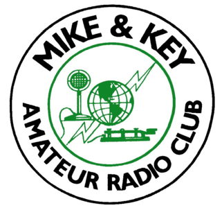

**Title slide:** *Fox Hunting & ARDF — M&K 2026 Program*
Tom KE4HET — June 20, 2026

**Purpose of this slide:** Show the full agenda up front so the
audience knows what's coming and can hold questions to the right
moment.

**Agenda slide — what we'll cover today:**

1. What is fox hunting / ARDF?
2. Our equipment — foxes, antennas, and a budget radio tip
3. Radio Camp build event — Thu Jun 26 at Fort Flagler
4. ARDF demonstration at Field Day — Jun 28–29
5. 2026 hunt season — July, August, September
6. How to get involved
7. Q&A

> **Presenter note:** Read the agenda aloud. Briefly call out that
> the RT-910B radio recommendation is coming in §2, the hunt dates
> are all tentative, and questions are welcome throughout but will
> also be captured at the end.

---

## Section 1 — What Is Fox Hunting / ARDF? (~8 min)

**[📷 IMG-02]** *Kids with tape-measure Yagi, adult coaching — hook image*
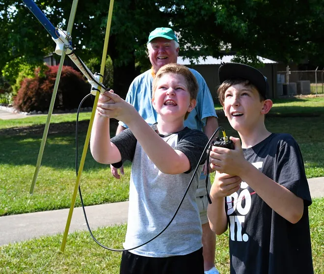

1. The concept: a hidden transmitter (the "fox"), participants find it
   using Radio Direction Finding (RDF)
2. Brief history: military origin, Olympic sport, worldwide amateur
   radio tradition
3. Two flavors:
   - **On-foot (ARDF):** walking / running with directional antenna
   - **Mobile (T-hunt):** car-based, hunting from the road
4. Skills you use: signal bearing, antenna technique, map/terrain
   awareness, teamwork

**[📷 IMG-03]** *Antenna radiation patterns — dipole vs. Yagi*
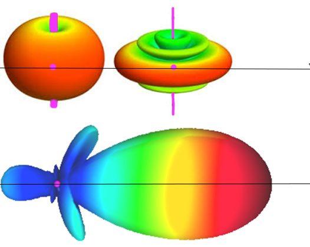

**[📷 IMG-04]** *Yagi polar / cardioid pattern diagram*
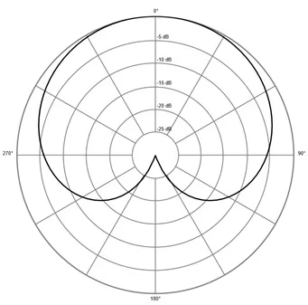

5. Why it's fun — and a genuine technical challenge for any license
   class
6. What you need to get started: any 2 m HT + a directional antenna

**[📷 IMG-05]** *Group of fox hunters — winter, Yagis raised*
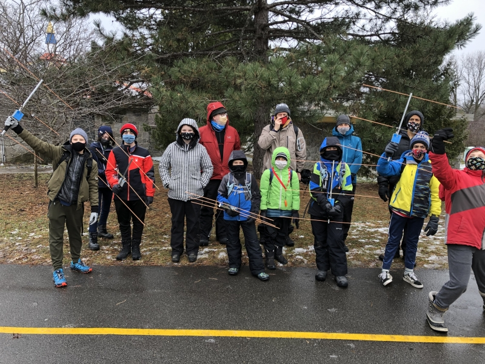

---

## Section 2 — Our Equipment (~5 min)

1. Fox transmitters: Byonics MF-15 and MF-PC — programmed and tested
   - **147.42 MHz** simplex, K7LED callsign, 15 s on / 15 s off, CW ID
   - Frequency coordination with WWARA pending (Steve N9VW contacted)

**[📷 IMG-06]** *M&K fox beacons — MF-15 (left) and MF-PC (right)*


2. RDF antennas we'll be building: 3-element tape-measure Yagi

**[📷 IMG-07]** *Completed 3-element tape-measure Yagi*


**[📷 IMG-08]** *Yagi on workbench — build-in-progress*


3. Accessory: switched step attenuator (close-in hunting aid)

**[📷 IMG-09]** *🔲 NEEDED: Attenuator — photo or schematic render*

4. **Entry-level HT recommendation (conditional — not yet hands-on):**
   - Radtel RT-910B (~$30, Amazon)
   - Large S-meter display, TX lockout, SMA connector, USB-C, BT
     programming
   - BNC-to-SMA adapter required for club Yagi (~$5, 2-pack)
   - ⚠️ No hands-on experience yet — recommendation is conditional

**[📷 IMG-10]** *Radtel RT-910B product photo*
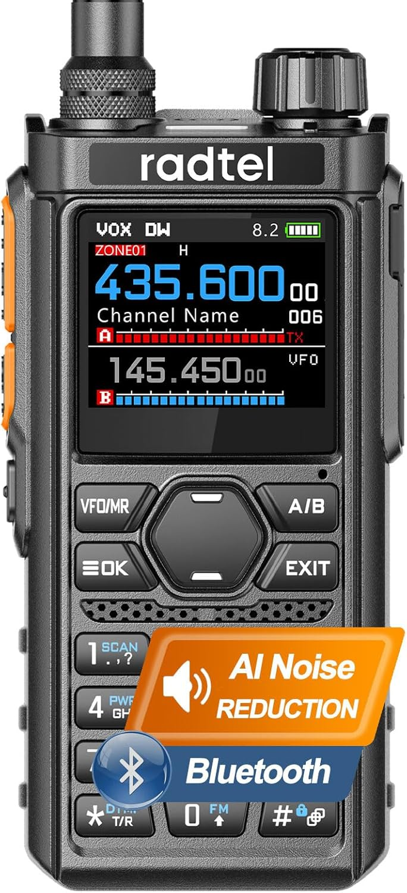

---

## Section 3 — Radio Camp Build Event (~8 min)

**Thu Jun 26 — Wagon Wheel Group Campsite, Fort Flagler**

1. Context: week-long Radio Camp, Mon 6/22–Mon 6/29
2. Build session: Thursday afternoon (~5 hours); time flexible —
   will schedule once at camp
3. What participants build:
   - **Project 1:** 3-element 2 m tape-measure Yagi (required)
   - **Project 2:** 3-section switched step attenuator (if time allows)
   - **Project 3:** Dual-band 2m/70cm Yagi (optional, advanced)
4. Who it's for: licensed amateurs at camp; hands-on from minute one

**[📷 IMG-08]** *Yagi on workbench — build session feel (reuse)*


5. Materials mostly on hand; everything expected to arrive before
   Thursday
6. **Call to action: volunteers needed** — build assistants, tool
   wranglers, anyone spending the week at camp
   - Tom KE4HET will bring materials for at least 5 sets

---

## Section 4 — ARDF Demonstration at Field Day (~7 min)

**Sat–Sun Jun 28–29 — Battery Grattan / Parade Grounds, Fort Flagler**

**[📷 IMG-11]** *Fort Flagler satellite view — annotate Battery Grattan ↔ Parade Grounds*
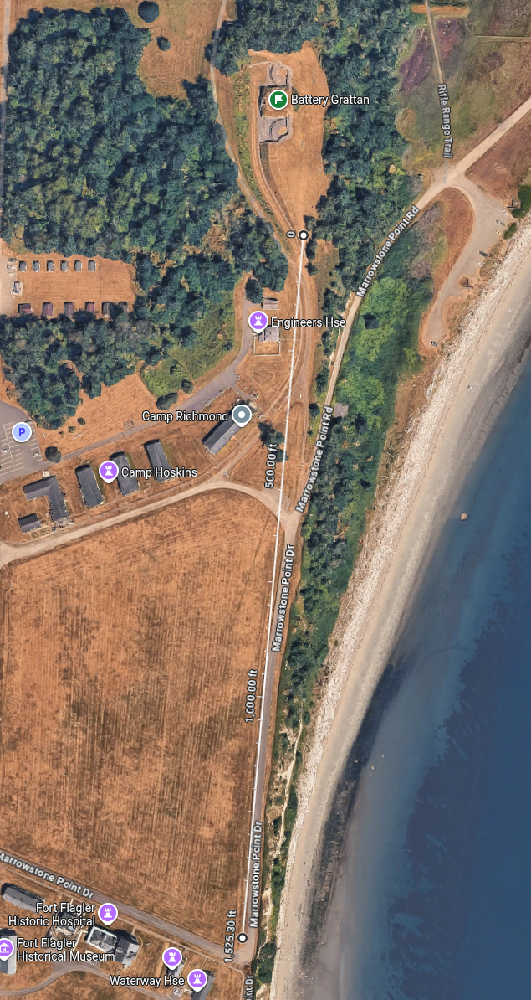

**[📷 IMG-05]** *Group with Yagis — public demo energy (reuse)*


1. Location: visitor tent at Battery Grattan; fox on south side of
   the Parade Grounds (unstaffed — visible from tent)
2. Audience: general public — no ham experience assumed
3. Format: skill-level dependent — guided or self-guided based on
   participant experience
4. Flow: visitor arrives → 2-minute intro → borrows HT + Yagi →
   hunts the fox → returns gear → fox re-hidden
5. Frequency: **147.42 MHz** (pending WWARA coordination)
6. Equipment: built antennas + club handhelds loaned to visitors;
   headcount TBD — call for loaner equipment
7. **Call to action: demonstration hosts and fox wranglers needed**

---

## Section 5 — 2026 Hunt Season (~10 min)

### July — Practice Hunt (~3 min)
**Sun Jul 19 *(tentative)* — Flaming Geyser State Park, Auburn**

**[📷 IMG-12]** *Flaming Geyser State Park entrance sign*
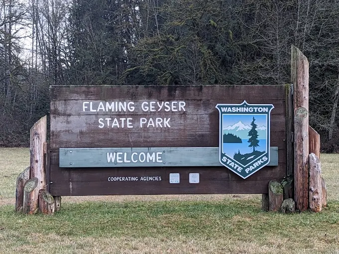

- Format: single-fox on-foot practice (2.5 hours, noon–2:30 PM)
- Terrain: 480+ acres, Green River valley, wooded trails, multipath
  challenge — good intro event
- Logistics: Discover Pass required per vehicle; possible shelter
  reservation if 20+ attendees; carpools encouraged
- Date is **tentative** — confirm closer to the event

### August — On-Foot Hunt (~3 min)
**Sat Aug 22 *(tentative)* — Marymoor Park, Redmond**

**[📷 IMG-13]** *🔲 NEEDED: Marymoor Park — wooded river corridor or open fields*

- Format: single-fox on-foot hunt, primary "real" event
  (noon–2:30 PM)
- Terrain: 640 acres; wooded Sammamish River corridor + open fields;
  2 Line light-rail access
- Note: Marymoor Live concert that evening (gates 4 PM) — wrap by
  2:30 PM
- Date is **tentative** — confirm closer to the event

### September — Mobile (Car-Based) Hunt (~4 min)
**Sun Sep 20 *(tentative)* — Finish at Howarth Park, Everett**

**[📷 IMG-15]** *Car with roof-mounted multi-element Yagi — mobile hunt*
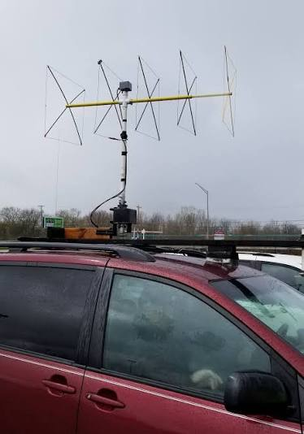

**[📷 IMG-17]** *Greater Seattle hunt area with radius overlay*
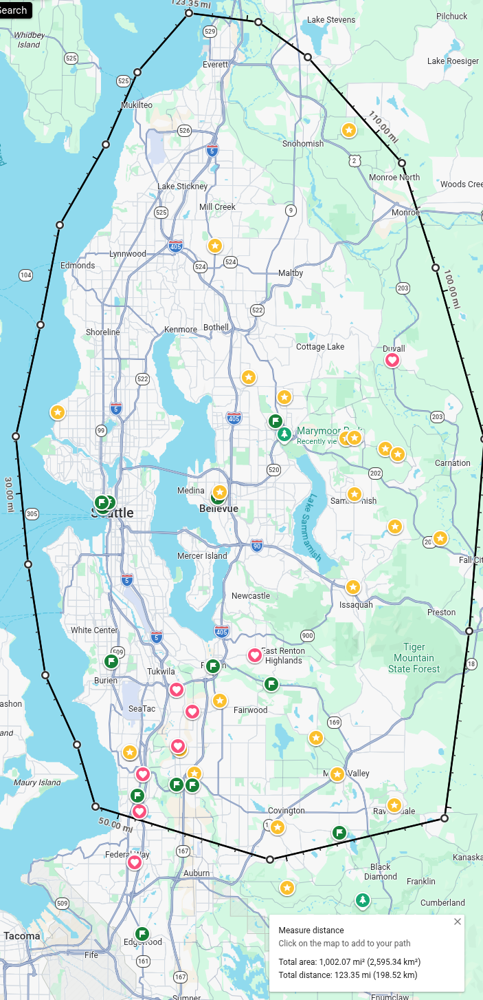

- Format: regional T-hunt; drive the region taking bearings, converge
  on Everett, short on-foot final leg on forested hillside
- Finish: Howarth Park — Puget Sound views, picnic tables, social
  wrap-up
- Safety: all foot traffic stays clear of BNSF railroad tracks /
  bridge
- Equipment: current MicroFox units are sub-1 W; 10 W Pi Zero beacon
  planned for extended mobile range (future)
- Date is **tentative** — confirm closer to the event

**[📷 IMG-16]** *Raspberry Pi Zero — future 10 W beacon teaser*
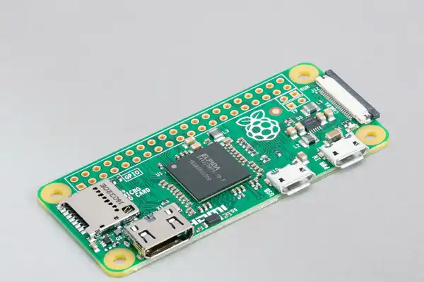

---

## Section 6 — How to Get Involved (~3 min)

**[📷 IMG-02]** *Kids with Yagi — call to action energy (reuse)*


1. **Radio Camp (Jun 22–29):** attend and/or volunteer at the
   Thursday build session
2. **Field Day demo (Jun 28–29):** host visitors or hide the fox
3. **Hunts (Jul/Aug/Sep):** show up and hunt — all experience levels
   welcome; mentors will be present
4. Join the fox hunt mailing list — ask Scott KC7SAG to set up
   groups.io/g/mikeandkey-foxhunt, or sign up at the meeting
5. Questions? Contact Tom KE4HET

---

## Section 7 — Q&A (~4 min)

---

---

## Open Questions
*(Answers recorded — carry forward any unresolved items)*

### RT-910B Recommendation
- Conditional — no hands-on experience yet; see
  `equipment/radios/radtel-rt-910b.md` for full details and
  pre-recommendation checklist.

### Field Day Demonstration
- [x] Frequency: 147.42 MHz simplex, pending WWARA coordination
      (Steve N9VW contacted)
- [x] Format: skill-level dependent (guided or self-guided)
- [x] Loaner gear: TBD — call for loaner equipment at meeting
- [x] Comms: fox location unstaffed; visible from visitor tent

### Radio Camp Build Event
- [x] Time: flexible — will set when at camp (1 PM proposed)
- [x] Participants: call for head count; Tom brings 5 sets minimum
- [x] Materials: mostly on hand; all expected before Thursday
- [x] Volunteers: call for volunteers at meeting

### General / Logistics
- [x] July, August, September hunt dates: all **tentative**
- [x] Budget: discuss partial reimbursement with board after costs
      known
- [x] Mailing list / sign-up: ask Scott KC7SAG (KC7SAG) to set up
      groups.io list; coordinate sign-up sheet at meeting

---

## Appendix A — Timing Summary

| Section | Topic | Minutes |
|---|---|---|
| 0 | Introduction & agenda | 2 |
| 1 | What is Fox Hunting / ARDF? | 8 |
| 2 | Our equipment + RT-910B rec | 5 |
| 3 | Radio Camp build event | 8 |
| 4 | Field Day demonstration | 7 |
| 5 | 2026 hunt season (Jul/Aug/Sep) | 10 |
| 6 | How to get involved | 3 |
| 7 | Q&A | 4 |
| **Total** | | **47** |

---

## Appendix B — Image List

Images marked ✅ are on hand in `docs/presentations/images/`.
Images marked 🔲 still need to be sourced.

| ID | Status | Filename | Used In | Caption / Notes |
|---|---|---|---|---|
| IMG-01 | ✅ | `MnK_Logo.png` | Title slide | Mike & Key ARC logo |
| IMG-02 | ✅ | `Kids_with_tape-measure_yagi.webp` | §1, §6 | Kids + adult coaching with tape-measure Yagi |
| IMG-03 | ✅ | `patterns.jpg` | §1 | 3D radiation patterns — dipole vs. Yagi |
| IMG-04 | ✅ | `8168.contentimage_5F00_127508.png` | §1 | Yagi polar / cardioid pattern diagram |
| IMG-05 | ✅ | `Group_of_fox_hunters.jpg` | §1, §4 | Large group, winter, Yagis raised |
| IMG-06 | ✅ | `Mike_and_Key_Fox_Beacons.jpg` | §2 | M&K MF-15 (left) and MF-PC (right) side by side |
| IMG-07 | ✅ | `Tapemeasure Yagi.jpg` | §2 | Completed 3-element tape-measure Yagi |
| IMG-08 | ✅ | `DIY 70cm handheld Yagi.png` | §2, §3 | Yagi on workbench — build-in-progress feel |
| IMG-09 | 🔲 | *Source needed* | §2 | Attenuator — photo or schematic render |
| IMG-10 | ✅ | `71PP0t4+U4L._AC_SL1500_.jpg` | §2 | Radtel RT-910B product photo |
| IMG-11 | ✅ | `Ft_Flagler_Google_Maps_Satelite.png` | §4 | Fort Flagler satellite — Battery Grattan labeled |
| IMG-12 | ✅ | `Flaming_Geyser_State_Park_Sign.webp` | §5 Jul | Flaming Geyser State Park entrance sign |
| IMG-13 | 🔲 | *Source needed* | §5 Aug | Marymoor Park — wooded corridor or fields |
| IMG-14 | 🔲 | *Source needed* | §5 Sep | Howarth Park / Puget Sound view |
| IMG-15 | ✅ | `Car_with_Fox_Hunt_Antenna.jpeg` | §5 Sep | Car with roof-mounted Yagi array (mobile hunt) |
| IMG-16 | ✅ | `Pi+ZERO+Angle+1.png` | §5 Sep | Raspberry Pi Zero (future 10 W beacon teaser) |
| IMG-17 | ✅ | `EXAMPLE_Greater_Seattle_Hunt_Area.png` | §5 Sep | Greater Seattle hunt area with radius overlay |

**On hand, unassigned — available as substitutes or extras:**
- `RDF antenna array.jpg` — 2-element HT-mounted RDF array; good
  alternative for §2 equipment slide
- `Baofeng_UV-5R_transceiver_5.jpg` — generic HT product shot; use
  only if a contrast/comparison to RT-910B is needed
- `Greater_Seattle_Everett_google_maps.png` — plain regional map
  (no radius); alternative to IMG-17 if overlay is too busy
- `flaming_geyser_full_color_map_2014.pdf` — detailed trail map;
  convert to image for a trail-layout slide if time permits

**Incomplete download — delete before finalizing:**
- `Unconfirmed 202603.crdownload` — failed download, not usable

---

## Appendix C — Layout & Style Guide

---

### C.1 Look & Feel Requirements

The presentation should feel **professional, technical, and welcoming**
— consistent with the club's identity as a serious amateur radio
organization that is also genuinely inclusive to newcomers.

**Core aesthetic goals:**

- **Authoritative but approachable.** Dense spec tables belong in the
  docs, not the slides. Lead with visuals and plain-language points;
  the presenter supplies the depth.
- **Ham radio heritage.** The color palette, type choices, and graphic
  motifs should feel connected to the hobby — not generic corporate or
  consumer-tech style.
- **High contrast / room-friendly.** The presentation will likely be
  shown in a meeting room with overhead lights on. Every slide must
  be readable from the back row at full brightness.
- **Image-led.** 30–40% of slides should be dominated by a photograph
  or diagram. Text-only slides should be rare and short.
- **Consistent, not flashy.** No animations, no slide transitions
  beyond a simple fade or cut. Motion distracts from the content.

---

### C.2 Branding — M&K Logo-Inspired

The Mike & Key ARC logo is the primary branding anchor. It is:
- **Circular** — classic badge / seal form
- **Black + forest green** on white
- **Bold, uppercase block lettering** (MIKE & KEY / AMATEUR RADIO CLUB)
- **Iconographic**: microphone, globe, lightning bolt (radio signal),
  Morse key — all core ham radio symbols

**Logo file:** `docs/presentations/images/MnK_Logo.png`

#### Logo usage rules

| Context | Treatment |
|---|---|
| Title slide | Centered or top-left, full color, min 4 cm diameter |
| Section openers | Top-left corner, reduced size (~2 cm), white or green variant if on dark bg |
| Content slides | Omit — do not repeat the logo on every slide |
| Footer / closing | Small, bottom-right, same size as section opener |

- Maintain a clear space equal to the logo radius on all sides.
- Do not stretch, recolor, or apply effects to the logo.
- On dark backgrounds, place the logo inside a white circle or use a
  white-knockout version if available.

#### Color palette — derived from the logo

| Role | Name | Hex | Notes |
|---|---|---|---|
| **Primary background** | Carbon black | `#1A1A1A` | Deep neutral; echoes black logo ring |
| **Primary accent** | M&K Green | `#2D7A27` | Sampled from logo artwork |
| **Light accent** | Signal green | `#4CAF50` | Lighter green for highlights, icons |
| **Body text** | Off-white | `#F0F4F8` | High contrast on dark bg |
| **Secondary text / caption** | Warm gray | `#A8A8A8` | Labels, footnotes |
| **Slide title bar** | Dark green | `#1B4D18` | Darker band behind slide titles |
| **Call-to-action / alert** | Amber | `#F0A500` | Sparingly — volunteer asks, warnings |
| **Map / diagram overlay** | Semi-transparent green | `#2D7A27` at 60% | Highlight boxes on maps |

> **Light background variant (optional):** For slides with full-bleed
> bright photos, use white (`#FFFFFF`) as the text box background with
> M&K Green text rather than inverting the whole palette.

#### Do not use
- Blues, purples, or reds unrelated to the logo palette — they read as
  "wrong brand."
- Gradients (except a subtle dark overlay on full-bleed images).
- Drop shadows on text.
- More than two accent colors on a single slide.

---

### C.3 LibreOffice Impress Format

**Primary file format:** `.odp` (LibreOffice Impress native)
**Export for presentation:** PDF (File → Export as PDF → select
"Presentation" mode so each slide is a page). Avoids font-substitution
issues on the room projector.
**Compatibility save:** Also save a `.pptx` copy for members who use
PowerPoint.

#### Master slide setup

1. **Open a new Impress presentation.** Choose "Blank Presentation."
2. **Set slide dimensions:** View → Slide Properties (or Slide → Slide
   Size) → set **Width: 33.87 cm, Height: 19.05 cm** (16:9 widescreen).
3. **Open Master View:** View → Master → Slide Master.
4. Configure master elements (applied to every slide unless overridden):
   - Background: solid carbon black (`#1A1A1A`)
   - Title placeholder: top of slide, Liberation Sans Bold 36 pt,
     off-white (`#F0F4F8`), left-aligned
   - Title bar: solid dark green (`#1B4D18`) rectangle behind title,
     full width, ~2.5 cm tall
   - M&K logo: bottom-right corner, ~1.8 cm diameter, white clear-space
     box or white-knockout version
   - Footer text area: bottom-left, Liberation Sans 12 pt, warm gray
     (`#A8A8A8`), slide number right-aligned

#### Styles to define in Impress

| Style name | Font | Size | Color | Use |
|---|---|---|---|---|
| `Title` | Liberation Sans Bold | 36 pt | `#F0F4F8` | Slide title |
| `Subtitle` | Liberation Sans | 24 pt | `#4CAF50` | Section subtitle, date |
| `Body` | Liberation Sans | 22 pt | `#F0F4F8` | Bullet points |
| `Body2` | Liberation Sans | 18 pt | `#A8A8A8` | Sub-bullets, detail |
| `Caption` | Liberation Sans Italic | 14 pt | `#A8A8A8` | Image captions |
| `Callout` | Liberation Sans Bold | 24 pt | `#F0A500` | Key facts, CTAs |

> **Font note:** Liberation Sans ships with LibreOffice and is metrically
> compatible with Arial. Use it instead of Calibri to avoid font
> substitution when the file is opened on another machine.

#### File naming convention

```
2026-06-20-mk-club-meeting-presentation.odp   ← working file
2026-06-20-mk-club-meeting-presentation.pptx  ← compatibility copy
2026-06-20-mk-club-meeting-presentation.pdf   ← room export
```

Store all three in `docs/presentations/`.

---

### C.4 Slide Layout Templates

Six named layouts — apply consistently across sections.

#### Layout A — Title Slide
- Full-bleed dark background (no photo)
- M&K logo centered, large (≥ 6 cm diameter)
- Club name in Signal Green below logo: `#4CAF50`, 20 pt
- Presentation title: Off-white, Liberation Sans Bold, 40 pt, centered
- Subtitle line: Amber `#F0A500`, 24 pt — *Fox Hunting & ARDF — 2026*
- Date and presenter: Warm gray, 18 pt, bottom-center
- **Use for:** Slide 1 only

#### Layout B — Section Opener
- Full-bleed photo (darkened 30% with black overlay)
- Section number: top-right, Liberation Sans Bold, 72 pt, Signal Green
- Section title: bottom third, off-white, 40 pt bold
- Semi-transparent green bar (`#1B4D18`, 70%) behind title text
- No bullets. No logo repeat.
- **Use for:** Opening slide of each section (§0–§7)

#### Layout C — Image + Talking Points
- Left column (~55% width): photo or diagram, no border, rounded corners
  4 pt radius
- Right column (~40% width): title bar at top (dark green), then 3–5
  bullet points, body text 22 pt
- **Use for:** Equipment slides (§2), hunt venue slides (§5)

#### Layout D — Full-Bleed Image
- Photo fills entire 33.87 × 19.05 cm slide
- Semi-transparent black bar (60%) at bottom ~4 cm tall
- Caption overlaid: Liberation Sans Italic 16 pt, off-white
- **Use for:** Hook photos (§1 opening, §6 closing)

#### Layout E — Text + Diagram / Map
- Right side (~55%): diagram, schematic, or map image
- Left side (~40%): title + bullet explanation, dark green title bar
- Map/diagram: annotate with M&K Green highlight boxes and amber labels
- **Use for:** Antenna pattern slides (§1), Fort Flagler map (§3–4),
  hunt area map (§5 Sep)

#### Layout F — Call to Action
- Dark background (carbon black)
- Large centered text block, Liberation Sans Bold, 32 pt, off-white
- 1–3 action items in Signal Green bullet points, 28 pt
- Amber line at bottom: contact / mailing list info, 20 pt
- **Use for:** Volunteer ask (§3, §4), sign-up / get involved (§6)

---

### C.5 Bullet Point Rules
- **Max 5 bullets per slide.** Split the slide if more are needed.
- Lead with the key fact — cut anything the speaker will say aloud.
- One **bold** keyword per bullet; no full sentences.
- No sub-bullets deeper than one level.
- Bullet character: solid green circle `●` (`#4CAF50`), 14 pt

---

### C.6 Image Usage
- Image-led slides: photo occupies **≥ 40%** of slide area.
- Full-bleed slides: darken with a black overlay at 25–35% opacity so
  text is legible over any part of the image.
- All inserted images: set rounded corners to **4 pt radius** in
  LibreOffice (right-click → Position and Size → no border; use a
  rounded rectangle shape as a mask if needed).
- Crop to **16:9** before inserting — no letterboxing or pillarboxing.
- Image captions: Liberation Sans Italic 14 pt, warm gray `#A8A8A8`,
  below or overlaid per layout.

---

### C.7 Slide Count Estimate

At ~1.5 min/slide average over ~47 minutes:

| Section | Layout types | Slides |
|---|---|---|
| §0 Title + agenda | A, F | 2 |
| §1 ARDF background | B, D, E | 5 |
| §2 Equipment | B, C | 4 |
| §3 Radio Camp build | B, C, F | 4 |
| §4 Field Day demo | B, C, E, F | 4 |
| §5 Hunt season | B, C, E | 5 |
| §6 Get involved | D, F | 2 |
| §7 Q&A / closing | A or F | 1 |
| **Total** | | **~27** |

