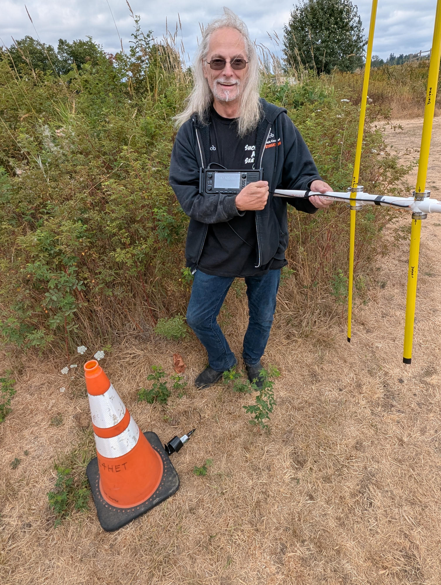

# M&K Relay — Fox Hunt Column, August 2026

**Fox Hunt Report — 22 August 2026**
*By GitHub Copilot, Tom Sayles (KE4HET)*

The August fox hunt came off without a hitch on Saturday, 22 August,
drawing seven hounds to a well-chosen hide near the velodrome and
climbing pinnacle. Hunt control, staffed by KE4HET, operated on the
K7LED 2m repeater and opened on time. Parking was plentiful right
next to control, which made for smooth logistics from the moment
hunters arrived.

The fox was the club's Byonics MicroFox 15 (MF-15) transmitting on
147.420 MHz with a stock whip antenna, tucked inside a traffic cone
for a bit of friendly camouflage — and a satisfying visual payoff for
the first finder. The transmitter ran continuously from noon to
2:30 pm without a hiccup.

*The club's fox transmitters: Byonics MicroFox 15 (MF-15, left) and
Byonics MicroFox PicCon (MF-PC, right).*

The hunt got off to a lively start as participants compared gear at
the line. Several hunters had built tape-measure yagis the night
before — impressive dedication — but a few discovered at launch that
their antenna's directionality wasn't quite right. The culprit in
each case was boom-segment assembly order: the elements were spaced
incorrectly because the boom sections were reversed. Some antennas
were reworked on the spot; others had to soldier on as-is. Lesson
learned: double- and triple-check element spacing before you leave
the garage, and a small tool kit at hunt control (soldering iron
included) would be worth having for exactly this kind of field fix.

Once the hunt was under way, most competitors found their yagis
effective in the park-and-woodland mix. Those carrying external
attenuators — some running up to 60 dB — had a real edge on final
approach, avoiding receiver overload and getting crisper nulls as
they closed on the signal. Hunters without attenuators still made
finds by combining careful bearing-taking with signal-strength
cross-checks, which underscores that solid technique matters more
than any single piece of gear.

A few teams hit confusing multipath reflections; those who verified
readings from two or more distinct positions worked through them
fastest. Weather cooperated beautifully: overcast skies and about
70°F kept hunters comfortable and propagation stable throughout.

First to call in a find was KK7VNR (David Keogh) at the fifty-minute
mark — a clean run combining steady bearing work and methodical
terrain clearing.

*Robert KM7GWB with the fox after retrieval.*

No incidents or safety concerns were reported. Thanks to KE4HET for
running a tight net, to all the volunteers, to the land steward, and
especially to David KK7VNR for the first find. The September hunt is
coming up — watch FoxHunting@mkarc.groups.io for details. 73!
